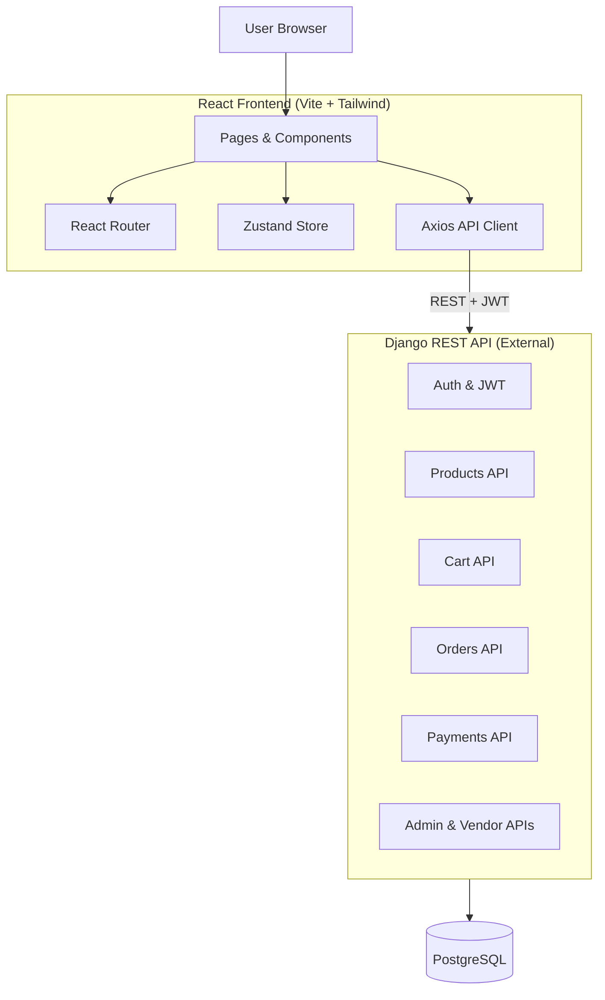

# E-Commerce Frontend

Modern **React + Vite + Tailwind CSS** frontend for a full-stack e-commerce platform.
This application **consumes backend services via REST APIs** provided by a **Django REST Framework backend** (separate repository).

---

## Overview

This repository contains the **frontend application only**.

* **Framework:** React 18 (Vite)
* **Styling:** Tailwind CSS
* **State Management:** Zustand
* **Routing:** React Router
* **API Communication:** Axios
* **Authentication:** JWT (handled via backend)
* **Backend:** Django REST API (external service)

---

## Architecture



---

## Features

### Authentication

* Login & registration pages
* JWT token handling
* Protected routes
* Role-based UI rendering (User / Vendor / Admin)

###  Shopping

* Product listing
* Shopping cart
* Checkout flow
* Backend-synced cart

###  Admin

* Vendor approval interface
* Role-based access control
* Protected admin routes

---

## Backend Integration

This frontend **connects to backend services via REST APIs**.

### Environment Variable

Create a `.env` file:

```env
VITE_API_BASE_URL=http://localhost:8000/api/v1
```

### Example API Client

```js
axios.get(`${import.meta.env.VITE_API_BASE_URL}/products/`);
```

>  Backend must be running for full functionality.

---

##  Getting Started

### Prerequisites

* Node.js 18+
* npm or pnpm
* Running backend API (local or remote)

---

### Installation

```bash
# Clone repository
git clone https://github.com/yourusername/ecommerce-frontend.git
cd ecommerce-frontend

# Install dependencies
npm install

# Start development server
npm run dev
```

Frontend will run at:
 **[http://localhost:5173](http://localhost:5173)**

---

## Folder Structure


### Detailed Structure

```
frontend/
├── public/
├── src/
│   ├── components/
│   │   ├── Layout.jsx              # Main layout with navbar
│   │   └── ProtectedRoute.jsx      # Route protection
│   ├── lib/
│   │   └── api.js                  # Axios API client
│   ├── pages/
│   │   ├── Login.jsx               # Login page
│   │   ├── Register.jsx            # Registration page
│   │   ├── Dashboard.jsx           # User dashboard
│   │   ├── Products.jsx            # Product listing
│   │   ├── Cart.jsx                # Shopping cart
│   │   └── admin/
│   │       └── VendorManagement.jsx # Admin vendor approval
│   ├── store/
│   │   └── useStore.js             # Zustand global state
│   ├── App.jsx                     # Main app component
│   ├── main.jsx                    # Entry point
│   └── index.css                   # Tailwind styles
├── index.html
├── package.json
├── vite.config.js
├── tailwind.config.js
└── postcss.config.js
```

---

## Configuration

### Vite Proxy (Optional for Local Development)

```js
export default defineConfig({
  server: {
    port: 5173,
    proxy: {
      '/api': 'http://localhost:8000',
    },
  },
});
```

---

## Scripts

```bash
npm run dev      # Start development server
npm run build    # Production build
npm run preview  # Preview production build
```

---

## Security Notes

* No secrets committed to repository
* JWT handled via backend
* Protected routes on frontend
* Role-based UI access

---

## Deployment

Set environment variable:

```env
VITE_API_BASE_URL=https://your-backend-domain.com/api/v1
```

---

##  Tech Stack

* React Js
* Vite
* Tailwind CSS
* Zustand
* Axios
* React Router

---

##  License

MIT License

---

<div align="center">

**Frontend Application for E-Commerce Platform**

Connected to Django REST API backend services

Built  using React + Vite + Tailwind

</div>
